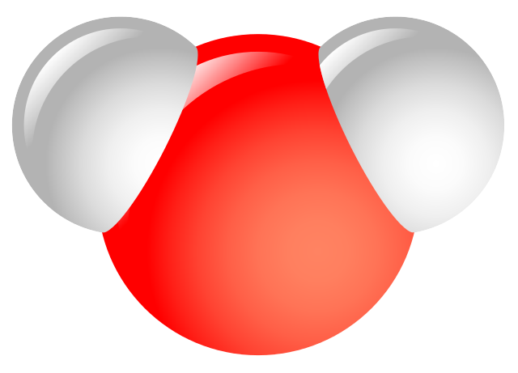

# gamessG

This script has been tested on `Python 3.7.3` ,`3.8.3`, and `3.8.6`

## usage

<div align=center></div>

* Click add-icon  to add files for calculation.

* After calculations, click the water-molecule-icon  will open the molecule models in [wxMacMolplt.exe](https://github.com/brettbode/wxmacmolplt).

* Click clean-icon  to delete all restart files in GAMESS root.

## settings

Settings are saved in [settings.json](https://github.com/Augus1999/gamessG/blob/master/settings.json) file.

```
{
  "GAMESSDIR": "C:\\Users\\Public\\gamess-64",
  "OUTDIR": "C:\\...\\GAMESS-log"
}
```
* GAMESSDIR: where the GAMESS program .EXE locates

* OUTDIR: where output files you wnat to be put
